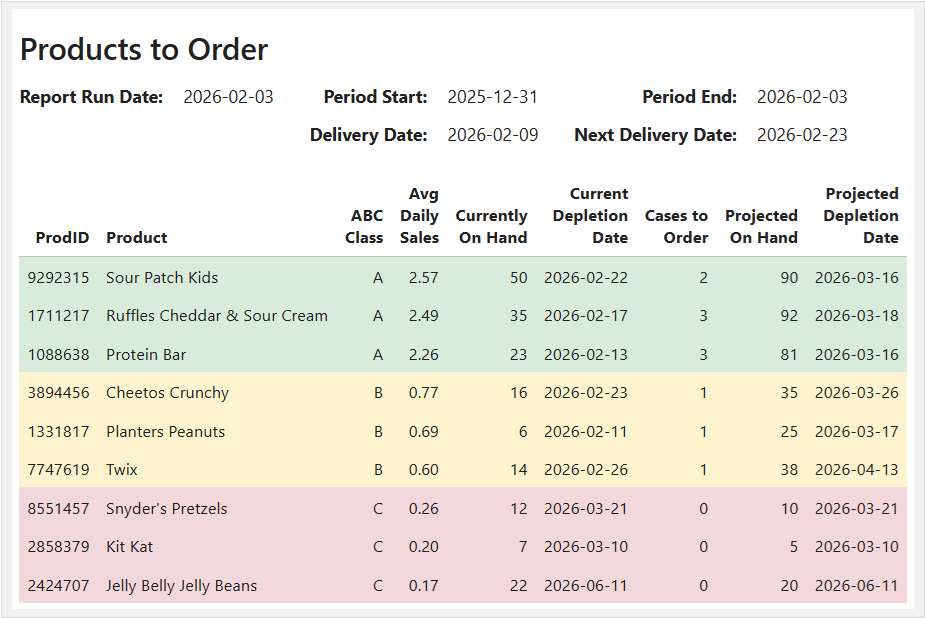

# Inventory Order Recommendation Engine
Retail inventory ordering is often reactive—based on what is low rather than what is needed. This project transforms that process into a rule-based decision system using historical sales and current inventory data.

Using sales velocity and an 80/15/5 Pareto (ABC) distribution, the system classifies products and applies ordering policies to generate purchase recommendations aligned with demand and delivery schedules.

# Project Outputs
- <b>Product Order Recommendations:</b> The system calculates order quantities by projecting inventory through the next delivery cycle and applying class-based stocking policies.

  

- [Interactive Pareto visualization of sales distribution (Tableau Public)](https://public.tableau.com/app/profile/jerred.lawson/viz/RetailStoreViz/DASHABCInventoryClassification)

  

  
  
# View the Project
 - 📄 Full Project Write-Up (recommended): [link to your PDF]
 - 📓 Jupyter Notebook: [Jupyter Notebook (GitHub)](https://github.com/JerredLawson/Inventory-Order-Recommendation-Engine/blob/main/notebooks/inventory_order_engine.ipynb)
 - 📊 Data Sources: /data

# Tech Stack
 - Python (pandas, numpy)
 - SQL (BigQuery)
 - Excel (data modeling, validation)
 - Tableau (visualization)
