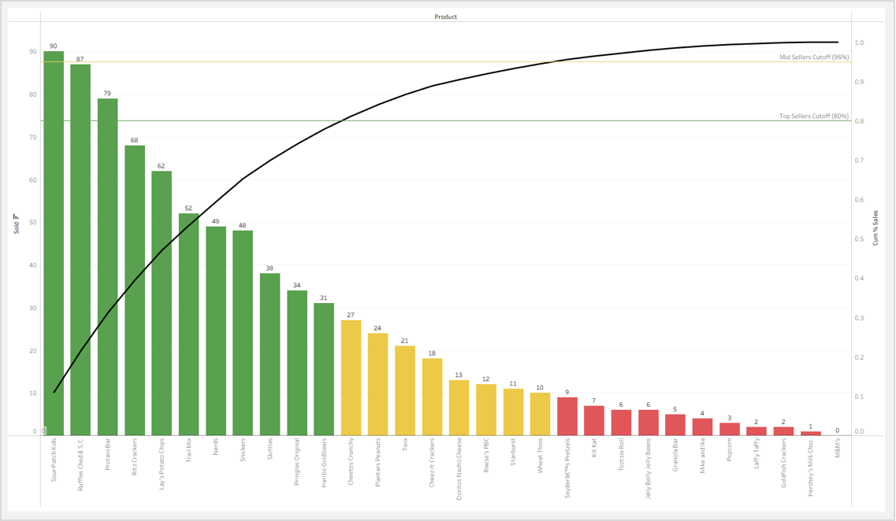
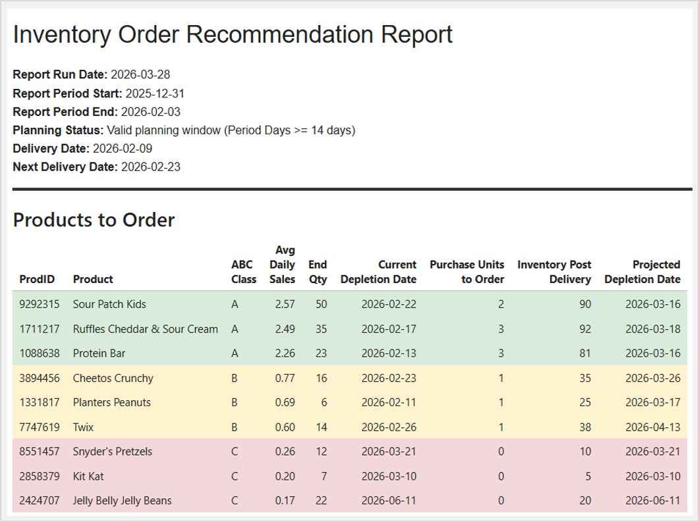

# Inventory Order Recommendation Engine  (Tableau + Python)
## What does it do? 
- Converts manual ordering into a rule-based decision engine
- Uses Pareto (80/15/5) classification to segment products
- Determines what to order and how much for each product
- Projects how long inventory will last and when it will run out
- Generates an HTML report

## Why does it matter?
When implemented in a casino gift shop, the system:
- Reduced ordering time from ~2 hours to ~15 minutes
- Reduced stockouts on top-selling products
- Reduced overstock and spoilage on slow-moving products
- Standardized ordering decisions across all products

## Project outputs:
### **Pareto Distribution** ([View Interactive Tableau Dashboard](https://public.tableau.com/app/profile/jerred.lawson/viz/RetailStoreViz/DASHABCInventoryClassification))

Products are classified into A/B/C categories based on share of units sold.
- **Class A (Top 80%):** carry 2 weeks of buffer stock.
- **Class B (Next 15%):** carry 1 week of buffer stock.
- **Class C (Remaining 5%):** no additional buffer; flagged for review  
   

### **Inventory Order Recommendation Report:** ([View PDF](https://jerredlawson.github.io/Inventory-Order-Recommendation-Engine/Inventory%20Order%20Recommendation%20Report.pdf))
 - Order quantities and projections based on historical sales velocity.

   
 - 
 
    
  
## View the Project
 - 📄 Full Project Write-Up: [link to your PDF]
 - 📓 Jupyter Notebook: [Jupyter Notebook (GitHub)](https://github.com/JerredLawson/Inventory-Order-Recommendation-Engine/blob/main/notebooks/inventory_order_engine.ipynb)
 - 📊 [Data Sources](https://github.com/JerredLawson/Inventory-Order-Recommendation-Engine/tree/main/data)

## Tech Stack
 - Python (pandas, numpy)
 - SQL (BigQuery)
 - Excel (data modeling, validation)
 - Tableau (visualization)
